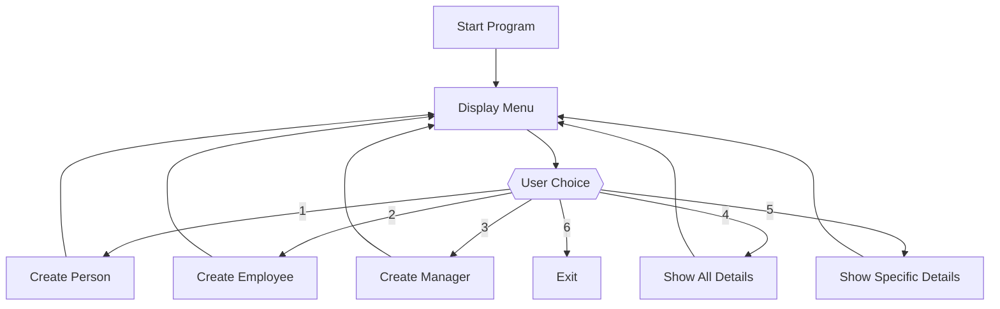
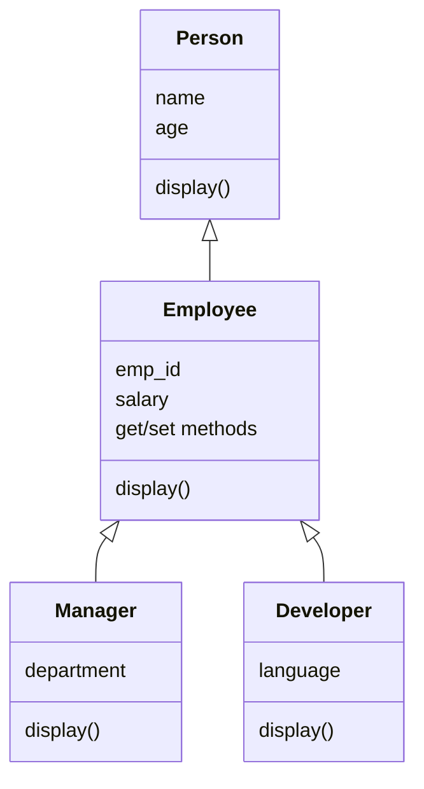

# 🧑‍💼 Python OOP Employee Management System


## 📌 Project Overview

This project is a **menu-driven Employee Management System** built using Object-Oriented Programming principles in Python.

It demonstrates real-world class design with inheritance, encapsulation, polymorphism, and safe input handling.

Users can create and manage different types of people including:

* Person
* Employee
* Manager

The system stores objects dynamically and allows users to display all records or filter specific types.

```
project5.py
```

---

## 🎯 Key Skills Demonstrated

* Object-Oriented Programming (OOP)
* Class design & inheritance
* Encapsulation with private attributes
* Polymorphism via method overriding
* Input validation
* CLI application design
* Dynamic object storage
* Iteration & filtering logic

---

## 🧭 System Architecture



---

## 🧱 Class Structure



---

## 🖥️ Application Walkthrough

### Main Menu Interface

The application runs continuously until the user exits. Each option demonstrates a core OOP concept.

📸 **Screenshot — Main Menu**

```
[Insert Main Menu Screenshot Here]
```

---

## ✍️ Option 1 — Create a Person

Creates a basic Person object with name and age, then stores it in memory.

Concepts demonstrated:

* Class instantiation
* Object storage in list

📸 **Screenshot — Create Person**

```
[Insert Option 1 Screenshot Here]
```

---

## 🧑‍💻 Option 2 — Create an Employee

Creates an Employee object with encapsulated attributes:

* Employee ID
* Salary

Concepts demonstrated:

* Inheritance
* Encapsulation
* Constructor chaining

📸 **Screenshot — Create Employee**

```
[Insert Option 2 Screenshot Here]
```

---

## 🧑‍💼 Option 3 — Create a Manager

Creates a Manager object extending Employee with department information.

Concepts demonstrated:

* Multi-level inheritance
* Method overriding

📸 **Screenshot — Create Manager**

```
[Insert Option 3 Screenshot Here]
```

---

## 📋 Option 4 — Show ALL Details

Displays every stored object using polymorphism via the `display()` method.

Also performs inheritance checks.

Concepts demonstrated:

* Polymorphism
* Iteration over objects
* Dynamic dispatch

📸 **Screenshot — Show All Details**

```
[Insert Option 4 Screenshot Here]
```

---

## 🔍 Option 5 — Show Specific Details

Allows filtering by object type:

* Person
* Employee
* Manager

Concepts demonstrated:

* Type checking
* Conditional filtering

📸 **Screenshot — Show Specific Details**

```
[Insert Option 5 Screenshot Here]
```

---

## 👋 Option 6 — Exit System

Gracefully exits the application and frees resources.

📸 **Screenshot — Exit Message**

```
[Insert Option 6 Screenshot Here]
```

---

## 🧠 Core Concepts Implemented

✅ Inheritance hierarchy
✅ Encapsulation using private attributes
✅ Polymorphism with method overriding
✅ Safe input validation
✅ Dynamic object handling
✅ CLI menu loop

---

## ▶️ How to Run

```bash
git clone <repository-url>
cd <project-folder>
python project5.py
```

---

## 📁 Project Structure

```
├── project5.py
├── README.md
├── opt1.png
├── opt2.png
├── opt3.png
├── opt4.png
├── opt5.png
└── opt6.png
```

---

## 💼 Portfolio Value

This project demonstrates the ability to:

* Design scalable class structures
* Apply OOP principles effectively
* Write clean and maintainable Python code
* Build interactive CLI applications
* Implement real-world object models

It serves as a strong demonstration of foundational software engineering skills.

---

## 🔮 Possible Enhancements

* Add Developer creation option
* Add file persistence (save/load data)
* Implement search by name or ID
* Add GUI with Tkinter
* Add unit tests
* Add logging system
* Convert to REST API with Flask


---

## 👤 Author

Developed as part of a Python OOP learning portfolio focused on mastering object-oriented design patterns and CLI systems.

---

⭐ If you found this project helpful, consider starring the repository!
